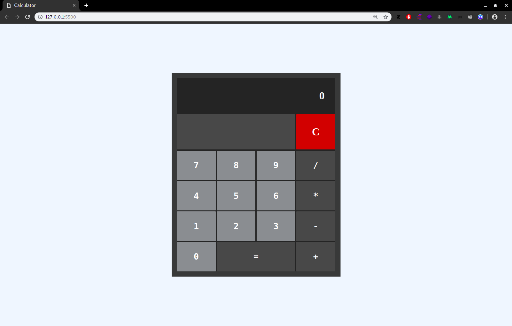

# Calculator

\*\* This is a project from The Odin Project

- [x] Your calculator is going to contain functions for all of the basic math operators you typically find on simple calculators, so start by creating functions for the following items and testing them in your browser’s console.
      add
      subtract
      multiply
      divide

- [x] Create a new function operate that takes an operator and 2 numbers and then calls one of the above functions on the numbers.

- [x] Create a basic HTML calculator with buttons for each digit, each of the above functions and an “Equals” key.

- [x] Create the functions that populate the display when you click the number buttons… you should be storing the ‘display value’ in a variable somewhere for use in the next step.

- [x] Make the calculator work! You’ll need to store the first number that is input into the calculator when a user presses an operator, and also save which operation has been chosen and then operate() on them when the user presses the “=” key.

- [x] EXTRA CREDIT: Make it look nice! This can be a good portfolio project… but not if it’s UGLY. At least make the operations a different color from the keypad buttons.
